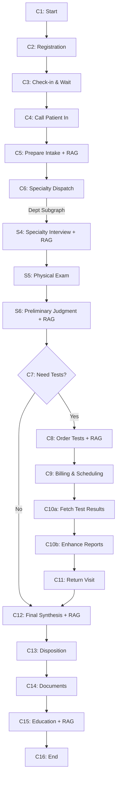

# 🏥 Hospital Agent System

<div align="center">

**基于 LangGraph 的智能医院门诊多智能体系统**

[](https://www.python.org/downloads/)
[](https://github.com/langchain-ai/langgraph)
[](LICENSE)
[](CONTRIBUTING.md)

[功能特性](#-功能特性) • [快速开始](#-快速开始) • [架构设计](#-架构设计) • [使用文档](#-使用指南) • [贡献指南](#-贡献)

</div>

---

## 📋 项目简介

Hospital Agent System 是一个基于 **LangGraph** 编排的智能医院门诊模拟系统，支持 **神经医学科等多个标准科室**的完整诊疗流程。项目通过多智能体协作（医生、护士、患者）、本地 RAG 知识库检索和可选的 DeepSeek LLM 增强，实现了高度可追溯、可复现的医疗流程仿真。

### 🎨 系统架构概览

本系统采用**分层架构**设计，从底层到顶层依次为：

1. **基础设施层**：数据库（MySQL）、向量数据库（ChromaDB）、LLM服务（DeepSeek）
2. **数据访问层**：DAO模式封装数据库操作，支持三表结构（患者、病例、检查）
3. **服务层**：医疗记录服务、预约服务、缴费服务、检验检查服务等
4. **智能体层**：医生Agent、护士Agent、患者Agent、检验Agent实现多智能体协作
5. **流程编排层**：LangGraph图编排，通用门诊流程（C1-C16）+ 专科子图（S4-S6）
6. **协调层**：医院协调器（HospitalCoordinator）管理资源调度与并发控制
7. **物理环境层**：HospitalWorld模拟真实医院物理空间、时间和资源约束
8. **应用层**：主程序入口、配置管理、日志系统

### 💡 核心设计理念

- **确定性优先**：所有Mock服务基于seed保证可复现，便于测试和调试
- **可观测性**：完整的审计追踪（audit_trail）记录每个决策节点的输入输出
- **可扩展性**：通用专科子图支持多科室，新增科室只需配置知识库
- **并发安全**：支持多医生多患者并发场景，通过协调器统一调度资源
- **物理约束**：模拟真实医院的物理空间、时间流逝、设备资源等约束
- **知识驱动**：关键节点强制RAG检索，引用溯源确保决策有据可依

### 🎯 核心特性

- 🤖 **多智能体协作**：医生、护士、患者三方智能体协同工作
- 🏗️ **LangGraph 编排**：通用流程 + 可插拔专科子图，支持 15 个标准科室
- 📚 **本地 RAG 系统**：基于 ChromaDB 的知识库检索，关键节点强制引用并记录溯源
- 🔒 **完全确定性**：Mock 外部系统（预约/缴费/检查），基于 seed 保证可复现
- 📊 **完整审计追踪**：每步操作记录 `audit_trail` 和 `citations`
- ⚡ **安全分流机制**：红旗症状自动触发升级（急诊/住院/会诊/转诊）

### 🏥 支持的科室

**当前已实现**：神经医学科（Neurology）

**架构支持扩展**：内科、外科、骨科、泌尿外科、妇产科、儿科、肿瘤科、感染性疾病科、皮肤性病科、眼耳鼻喉口腔科、精神心理科、急诊医学科、康复疼痛科、中医科等（通用专科子图设计，新增科室只需配置知识库和科室参数）

> **⚠️ 免责声明**：本项目仅用于技术演示和教学目的，不构成任何医疗建议。如有健康问题，请咨询专业医疗机构。

### 📊 系统能力矩阵

| 能力维度 | 实现状态 | 说明 |
|---------|---------|------|
| **多智能体协作** | ✅ 完整实现 | 医生、护士、患者、检验科四方协作 |
| **并发患者处理** | ✅ 完整实现 | 支持3医生10患者并发，自动队列调度 |
| **物理环境模拟** | ✅ 完整实现 | 时间流逝、空间移动、设备排队 |
| **数据库持久化** | ✅ 完整实现 | MySQL三表结构，支持多次就诊 |
| **RAG知识检索** | ✅ 完整实现 | ChromaDB向量库，关键节点强制检索 |
| **LLM增强** | ⚡ 可选启用 | DeepSeek API，报告解读与叙述 |
| **审计追踪** | ✅ 完整实现 | 每步记录输入输出、RAG引用、决策理由 |
| **红旗症状识别** | ✅ 完整实现 | 自动触发急诊/住院/会诊/转诊 |
| **多科室支持** | 🔧 架构就绪 | 当前神经医学科，框架支持扩展 |

---

## 🚀 快速开始

### 环境要求

- Python 3.10+
- pip 包管理器

### 安装步骤

1. **克隆仓库**

```bash
git clone https://github.com/yourusername/hospital-agent-system.git
cd hospital-agent
```

2. **安装依赖**

```bash
pip install -r requirements.txt
```

3. **初始化知识库**

```bash
python scripts/seed_kb_examples.py
```

4. **构建向量索引**

```bash
python scripts/build_index.py
```

生成的索引存储在 `.chroma/` 目录中。

5. **下载数据集（推荐）**

```bash
# 下载 DiagnosisArena 数据集到本地（首次运行推荐）
python download_dataset.py

# 或指定自定义目录
python download_dataset.py --output ./my_dataset
```

> 💡 **提示**：下载后系统会自动使用本地数据集，无需联网。如果跳过此步骤，首次运行时会自动从 HuggingFace 下载并缓存。

### 运行系统

#### 单患者模式

```bash
# 使用默认配置
python src/main.py

# 指定病例ID
python src/main.py --dataset-id 15
```

#### 多患者模式

```bash
# 运行多患者测试
python test_shared_environment.py
```

#### DeepSeek 配置

```bash
# 设置 API Key (PowerShell)
$env:DEEPSEEK_API_KEY="sk-your-key-here"

# 或使用 .env 文件
# 创建 .env 文件并添加: DEEPSEEK_API_KEY=sk-your-key-here

# 运行
python src/main.py 
```

### 配置文件

项目支持通过 `config.yaml` 进行配置，优先级：`CLI 参数 > 环境变量 > config.yaml > 默认值`

```yaml
llm:
  backend: deepseek        # mock 或 deepseek
  enable_reports: false    # LLM 增强报告

agent:
  max_questions: 15        # 医生最多问题数
  dataset_id: 61           # 数据集索引
  use_hf_data: true        # 使用 HuggingFace 数据

rag:
  persist_dir: .chroma
  collection_name: hospital_kb

system:
  seed: 42                 # 随机种子
```

---

## 📁 项目结构

```
hospital_agent/
├── src/
│   ├── agents/              # 智能体实现
│   │   ├── doctor_agent.py  # 医生智能体
│   │   ├── nurse_agent.py   # 护士智能体
│   │   └── patient_agent.py # 患者智能体
│   ├── graphs/              # LangGraph 流程图
│   │   ├── common_opd_graph.py          # 通用门诊流程 (C1-C16)
│   │   ├── router.py                    # 流程装配器
│   │   └── dept_subgraphs/              # 专科子图
│   │       └── common_specialty_subgraph.py  # 通用专科子图 (S4-S6)
│   ├── services/            # 外部系统 Mock
│   │   ├── appointment.py   # 预约服务
│   │   ├── billing.py       # 缴费服务
│   │   ├── lab.py           # 实验室检查
│   │   ├── imaging.py       # 影像检查
│   │   ├── endoscopy.py     # 内镜检查
│   │   ├── neurophysiology.py  # 神经生理检查
│   │   ├── document.py      # 文书生成
│   │   └── llm_client.py    # LLM 客户端
│   ├── state/               # 状态管理
│   │   └── schema.py        # BaseState 定义
│   ├── prompts/             # LLM 提示词
│   ├── rag.py               # RAG 检索器
│   ├── loaders.py           # 数据加载器
│   ├── utils.py             # 工具函数
│   ├── config.py            # 配置管理
│   └── main.py              # CLI 入口
├── kb/                      # 知识库
│   ├── hospital/            # 医院通用知识
│   ├── forms/               # 文书模板
│   └── {dept}/              # 各科室专业知识
├── scripts/
│   ├── seed_kb_examples.py  # 初始化知识库
│   └── build_index.py       # 构建向量索引
├── config.yaml              # 配置文件
├── requirements.txt         # 依赖清单
└── README.md
```

---

## 🏗️ 架构设计


### 诊疗流程 (C1-C16)

> **说明**：C0（护士预检分诊）已在 `main.py` 初始化时完成，图中从C1开始。



### 关键节点说明

| 节点 | 描述 | RAG 强制检索 | LLM 增强 |
|------|------|-------------|---------|
| **C5** | 问诊准备 | ✅ hospital SOP | ❌ |
| **S4** | 专科问诊（子图） | ✅ 专科知识库 | 可选 |
| **S6** | 初步判断（子图） | ✅ 检查指南 | ❌ |
| **C8** | 开单与准备说明 | ✅ 通用SOP + 专科准备 | ❌ |
| **C10a** | 获取检查结果 | ❌ | 可选（数据集/LLM） |
| **C10b** | 增强报告叙述 | ❌ | 可选（报告解读） |
| **C12** | 综合分析诊断 | ✅ 诊疗方案/文书模板 | 可选 |
| **C15** | 宣教与随访 | ✅ 通用+专科健康教育 | 可选 |

---

## 🧪 数据集支持

### HuggingFace 数据集集成

项目支持从 [SII-SPIRAL-MED/DiagnosisArena](https://huggingface.co/datasets/SII-SPIRAL-MED/DiagnosisArena) 加载真实医疗诊断案例。


### 环境变量配置

| 变量名 | 说明 | 默认值 | 可选值 |
|--------|------|--------|-------|
| `DEEPSEEK_API_KEY` | DeepSeek API 密钥 | - | `sk-xxx` |
| `DEEPSEEK_MODEL` | 模型名称 | `deepseek-chat` | `deepseek-chat` |
| `DEEPSEEK_BASE_URL` | API 端点 | `https://api.deepseek.com` | - |
| `ENABLE_DATASET_TRANSLATION` | 启用数据集翻译 | `true` | `true`/`false`/`1`/`0` |

---

## 📚 核心模块详解

### 智能体系统（Multi-Agent）

#### 1. 医生智能体 (`doctor_agent.py`)
- 动态设置专科身份（支持 15 个科室）
- 专科问诊与病史采集
- 初步判断与检查建议
- 综合分析与诊疗方案制定

#### 2. 护士智能体 (`nurse_agent.py`)
- 预检分诊
- 检查/检验前准备说明
- 检查执行协助
- 健康宣教

#### 3. 患者智能体 (`patient_agent.py`)
- 模拟真实患者症状
- 基于病例数据回答问题
- 支持 HuggingFace 数据集加载

### LangGraph 编排

#### 通用门诊流程 (`common_opd_graph.py`)
实现了完整的 C1-C16 节点流程：

> **注意**：C0（护士预检分诊 + Agent初始化）已移至 `main.py` 的初始化阶段执行，流程从C1开始。

**前置流程**
- C1: Start - 验证状态、记录开始时间、显示患者概览
- C2: Registration - 挂号预约
- C3: Check-in & Wait - 签到候诊
- C4: Call In - 叫号入诊室

**核心诊疗**
- C5: Prepare Intake - 问诊准备（检索医院通用SOP，初始化问诊记录）
- C6: Specialty Dispatch - 专科子图分发（实际问诊在此执行）
- C7: Decide Path - 路径决策（是否需要辅助检查）

**辅助检查分支**
- C8: Order & Explain Tests - 开单并检索准备知识 + RAG（通用SOP + 专科准备说明）
- C9: Billing & Scheduling - 缴费与预约调度（生成检查准备清单）
- C10a: Fetch Test Results - 获取检查结果数据（从数据集或LLM生成）
- C10b: Enhance Reports - 增强检查报告（生成叙述和解读）
- C11: Return Visit - 报告回诊（智能补充问诊）

**诊断与处理**
- C12: Final Synthesis - 综合分析与诊断 + RAG（诊疗方案/文书模板）
- C13: Disposition - 处置决策（根据升级建议）
- C14: Documents - 使用LLM生成门诊医疗文书
- C15: Education & Follow-up - 宣教与随访 + RAG（健康教育）
- C16: End - 结束流程（记录统计、评估准确性）

#### 专科子图 (`common_specialty_subgraph.py`)
支持 15 个科室的通用专科子图（S4-S6）：
- S4: Specialty Interview - 专科问诊 + 动态 RAG
- S5: Physical Exam - 体格检查
- S6: Preliminary Judgment - 初判 + RAG（检查指南）

### 状态管理 (`state/schema.py`)

**BaseState** 包含完整的就诊状态：

```python
class BaseState(BaseModel):
    run_id: str                    # 运行ID
    dept: str                      # 科室
    chief_complaint: str           # 主诉
    history_present_illness: dict  # 现病史
    ordered_tests: List[dict]      # 检查/检验单
    test_results: List[dict]       # 检查报告
    diagnosis: dict                # 诊断
    treatment_plan: dict           # 治疗方案
    escalations: List[str]         # 升级建议
    audit_trail: List[dict]        # 审计追踪
    retrieved_chunks: List[dict]   # RAG 检索结果
    # ... 更多字段
```

**审计追踪格式**：
```json
{
  "ts": "2026-01-02T10:30:00Z",
  "node_name": "C5_common_intake",
  "inputs_summary": {...},
  "outputs_summary": {...},
  "decision": "proceed_to_specialty",
  "citations": [
    {"doc_id": "hospital_sop_001", "chunk_id": "ch_003", "score": 0.89}
  ],
  "flags": ["LLM_USED", "RAG_RETRIEVED"]
}
```

### RAG 系统

#### 知识库结构 (`kb/`)
```
kb/
├── hospital/          # 医院通用知识
│   ├── sop_intake.md
│   ├── sop_billing_reports.md
│   └── education_common.md
├── forms/             # 文书模板
│   ├── template_emr.md
│   ├── template_diagnosis_cert.md
│   └── template_sick_leave.md
└── {dept}/            # 各科室专业知识
    ├── education_{dept}.md
    ├── guide_redflags.md
    ├── plan_{dept}.md
    └── prep_{exam}.md
```

#### 检索器 (`rag.py`)
- **嵌入函数**：HashEmbeddingFunction（完全本地、确定性）
- **向量数据库**：ChromaDB（持久化到 `.chroma/`）
- **检索策略**：支持按 `dept` 和 `type` 过滤
- **元数据**：自动包含 `doc_id`、`chunk_id`、`source`、`updated_at`

### 外部系统 Mock

所有 Mock 服务基于 `seed` 保证确定性输出：

| 服务 | 模块 | 功能 |
|------|------|------|
| 预约服务 | `appointment.py` | 挂号、签到、叫号 |
| 缴费服务 | `billing.py` | 费用计算、缴费记录 |
| 实验室 | `lab.py` | 血常规、肝功能、Hp C13 等 |
| 影像检查 | `imaging.py` | CT、MRI、超声 |
| 内镜检查 | `endoscopy.py` | 胃镜、肠镜、肠道准备 |
| 神经生理 | `neurophysiology.py` | EEG、EMG、NCV |
| 文书生成 | `document.py` | 门诊病历、诊断证明、病假条 |

### 安全机制

#### 红旗症状识别 (`utils.py`)
自动触发升级建议：
- 🚨 **急诊**：生命体征异常、急性胸痛等
- 🏥 **住院**：严重并发症、需要住院治疗
- 👥 **会诊**：疑难病例、多学科协作
- ➡️ **转诊**：超出本科室诊疗范围

#### 否定词识别
避免误判：`"无黑便"` ≠ `"黑便"`

---

## 🔧 高级用法

### 自定义配置

创建自定义配置文件：

```yaml
# my_config.yaml
llm:
  backend: deepseek
  enable_reports: true

agent:
  max_questions: 20
  dataset_id: 100

system:
  seed: 12345
  save_trace: custom_trace.json
  enable_trace: true
```

运行：
```bash
python src/main.py --config my_config.yaml
```

### 审计追踪分析

保存的审计追踪可用于：
- 流程回放与分析
- RAG 引用验证
- LLM 调用监控
- 性能优化

```python
import json

# 加载追踪
with open("trace.json") as f:
    trace = json.load(f)

# 分析 RAG 引用
for entry in trace["audit_trail"]:
    if entry.get("citations"):
        print(f"{entry['node_name']}: {len(entry['citations'])} citations")

# 检查 LLM 调用
llm_calls = [e for e in trace["audit_trail"] if "LLM_USED" in e.get("flags", [])]
print(f"Total LLM calls: {len(llm_calls)}")
```

### 批量处理

处理多个病例：

```bash
# Bash
for i in {1..10}; do
  python src/main.py --dataset-id $i --save-trace "trace_$i.json"
done

# PowerShell
1..10 | ForEach-Object {
  python src/main.py --dataset-id $_ --save-trace "trace_$_.json"
}
```

---

## 🧪 测试

### 运行测试

```bash
# 运行所有测试
pytest

# 详细输出
pytest -v

# 测试覆盖率
pytest --cov=src --cov-report=html
```

### 测试覆盖范围

- ✅ 通用门诊流程（C1-C16）
- ✅ 专科子图（15 个科室）
- ✅ RAG 检索与引用追踪
- ✅ Mock 服务确定性
- ✅ LLM 失败降级
- ✅ 红旗症状触发

---
## 📖 核心API参考

本章节详细介绍系统各模块的核心类和函数。

### 🤖 智能体模块 (`src/agents/`)

#### DoctorAgent - 医生智能体

```python
class DoctorAgent:
    """医生智能体：基于RAG知识库进行问诊、开单、诊断"""
    
    def __init__(self, dept: str, retriever: ChromaRetriever, 
                 llm: LLMClient | None, max_questions: int = 10)
```

**核心方法**：

| 方法 | 参数 | 返回值 | 功能说明 |
|------|------|--------|---------|
| `reset()` | 无 | None | 重置医生状态，清空上一患者的问诊历史（多患者场景必调用） |
| `generate_one_question()` | chief_complaint, context, rag_chunks | str | 生成单个问诊问题（一问一答模式） |
| `ask_patient()` | patient_agent, chief_complaint, context | dict | 完整问诊流程，返回结构化病史 |
| `suggest_tests()` | collected_info | list[dict] | 基于问诊结果建议检查项目 |
| `analyze_and_diagnose()` | collected_info, test_results | dict | 综合分析给出诊断和治疗方案 |

**使用示例**：
```python
# 初始化医生
doctor = DoctorAgent(dept="neurology", retriever=retriever, llm=llm, max_questions=5)

# 问诊患者
history = doctor.ask_patient(patient_agent, chief_complaint="头痛3天", context="神经科专科问诊")

# 建议检查
tests = doctor.suggest_tests(doctor.collected_info)

# 重置状态（处理下一个患者前）
doctor.reset()
```

---

#### NurseAgent - 护士智能体

```python
class NurseAgent:
    """护士智能体：分诊、生命体征测量、健康宣教"""
    
    def __init__(self, llm: LLMClient | None, max_triage_questions: int = 3)
```

**核心方法**：

| 方法 | 参数 | 返回值 | 功能说明 |
|------|------|--------|---------|
| `reset()` | 无 | None | 重置护士状态，清空分诊历史 |
| `triage()` | patient_description | str | 根据患者描述进行科室分诊 |
| `get_triage_summary()` | 无 | dict | 获取分诊结果摘要 |
| `explain_test_prep()` | test_name, prep_info | str | 解释检查前准备事项 |

---

#### PatientAgent - 患者智能体

```python
class PatientAgent:
    """患者智能体：模拟真实患者症状和回答"""
    
    def __init__(self, known_case: dict, llm: LLMClient | None, 
                 chief_complaint: str = "")
```

**核心方法**：

| 方法 | 参数 | 返回值 | 功能说明 |
|------|------|--------|---------|
| `describe_to_nurse()` | 无 | str | 向护士描述症状（口语化） |
| `answer_doctor_question()` | question | str | 回答医生问题（基于病例数据） |
| `report_symptom_change()` | context | str | 报告症状变化 |

---

#### LabAgent - 检验智能体

```python
class LabAgent:
    """检验智能体：执行实验室检查，解读结果"""
    
    def __init__(self, llm: LLMClient | None)
```

**核心方法**：

| 方法 | 参数 | 返回值 | 功能说明 |
|------|------|--------|---------|
| `interpret_result()` | test_name, result_data | dict | 解读检验结果，生成叙述和异常标记 |
| `compare_with_reference()` | test_name, value | bool | 对比参考范围判断是否异常 |

---

### 🏥 医院协调器 (`src/hospital_coordinator.py`)

#### HospitalCoordinator - 中央调度系统

```python
class HospitalCoordinator:
    """医院协调器：管理多医生多患者的并发场景"""
    
    def __init__(self, medical_record_service: MedicalRecordService)
```

**资源管理**：

| 方法 | 参数 | 返回值 | 功能说明 |
|------|------|--------|---------|
| `register_doctor()` | doctor_id, name, dept | None | 注册医生资源到系统 |
| `get_available_doctors()` | dept | list[DoctorResource] | 获取指定科室的空闲医生 |
| `set_doctor_offline()` | doctor_id | None | 设置医生离线状态 |

**患者管理**：

| 方法 | 参数 | 返回值 | 功能说明 |
|------|------|--------|---------|
| `register_patient()` | patient_id, patient_data, dept, priority | str | 患者挂号，创建病例 |
| `enqueue_patient()` | patient_id | None | 加入等候队列，触发自动分配 |
| `update_patient_status()` | patient_id, status | None | 更新患者状态 |

**调度算法**：

| 方法 | 参数 | 返回值 | 功能说明 |
|------|------|--------|---------|
| `_try_assign_doctor()` | dept | bool | 自动为等候患者分配医生（负载均衡） |
| `assign_doctor_manually()` | patient_id, doctor_id | bool | 手动指定医生 |
| `release_doctor()` | doctor_id | None | 释放医生资源，尝试分配下一患者 |

**会诊调度**：

| 方法 | 参数 | 返回值 | 功能说明 |
|------|------|--------|---------|
| `request_consultation()` | patient_id, requesting_doctor_id, target_dept, reason | str\|None | 请求跨科室会诊 |
| `end_consultation_session()` | patient_id, consulting_doctor_id | None | 结束会诊 |

**统计查询**：

| 方法 | 参数 | 返回值 | 功能说明 |
|------|------|--------|---------|
| `get_doctor_status()` | doctor_id | dict | 获取医生详细状态 |
| `get_dept_status()` | dept | dict | 获取科室整体状态 |
| `get_system_stats()` | 无 | dict | 获取系统全局统计 |

**并发特性**：
- ✅ 线程安全：使用RLock保护共享资源
- ✅ 优先级队列：按优先级和到达时间排序
- ✅ 自动重试：分配失败时自动循环尝试
- ✅ 资源竞争：支持多线程并发患者提交

---

### 🌍 物理环境模拟 (`src/environment/hospital_world.py`)

#### HospitalWorld - 医院物理世界

```python
class HospitalWorld:
    """医院世界环境：模拟物理空间、时间和资源"""
    
    def __init__(self, start_time: datetime = None)
```

**核心功能**：

| 方法 | 参数 | 返回值 | 功能说明 |
|------|------|--------|---------|
| `add_agent()` | agent_id, agent_type, initial_location | bool | 添加agent到世界（患者/医生/护士） |
| `move_agent()` | agent_id, target_location | (bool, str) | 移动agent到指定位置（自动寻路） |
| `advance_time()` | minutes | None | 推进时间，更新物理状态 |
| `use_device()` | agent_id, device_name | (bool, str) | 使用医疗设备（自动排队） |
| `perform_exam()` | patient_id, exam_type, priority | (bool, str) | 执行检查（设备调度） |
| `get_observation()` | agent_id | dict | 获取agent当前观察（位置、设备、其他人员） |

**物理约束**：
- 🚪 空间拓扑：14个位置节点，定义连通关系
- ⏱️ 时间流逝：移动、等待、检查消耗真实时间
- 🏥 设备资源：CT、MRI、内镜等有数量限制，需排队
- 👥 人员状态：体力、负荷、效率动态变化

---

### 📊 状态管理 (`src/state/schema.py`)

#### BaseState - 流程状态

```python
class BaseState(BaseModel):
    """LangGraph流程的完整状态对象"""
```

**核心字段分类**：

**基本信息**：
- `run_id`: 运行ID（唯一标识）
- `dept`: 就诊科室
- `patient_id`: 患者ID
- `chief_complaint`: 主诉

**问诊记录**：
- `agent_interactions`: 智能体交互记录（问诊对话、分诊记录等）
- `history`: 病史信息
- `exam_findings`: 体格检查结果

**检查检验**：
- `ordered_tests`: 已开具的检查单
- `test_results`: 检查报告结果
- `need_aux_tests`: 是否需要辅助检查

**诊断治疗**：
- `diagnosis`: 诊断结果
- `treatment_plan`: 治疗方案
- `medications`: 药物处方

**流程控制**：
- `escalations`: 升级建议（急诊/住院/会诊/转诊）
- `audit_trail`: 审计追踪（每步决策记录）
- `retrieved_chunks`: RAG检索结果

**物理环境**：
- `world_context`: HospitalWorld实例引用
- `current_location`: 当前物理位置
- `physical_state_snapshot`: 物理状态快照

**核心方法**：

| 方法 | 参数 | 返回值 | 功能说明 |
|------|------|--------|---------|
| `add_audit()` | entry | None | 添加审计记录 |
| `add_retrieved_chunks()` | chunks | None | 添加RAG检索结果 |
| `sync_physical_state()` | 无 | None | 同步物理环境状态到快照 |

---

### 🔎 RAG检索系统 (`src/rag.py`)

#### ChromaRetriever - 向量检索器

```python
class ChromaRetriever:
    """基于ChromaDB的向量检索器"""
    
    def __init__(self, persist_dir: Path, collection_name: str = "hospital_kb")
```

**核心方法**：

| 方法 | 参数 | 返回值 | 功能说明 |
|------|------|--------|---------|
| `retrieve()` | query, filters, k | list[dict] | 检索相关知识片段（支持dept/type过滤） |
| `get_collection_stats()` | 无 | dict | 获取知识库统计信息 |

**辅助函数**：

| 函数 | 参数 | 返回值 | 功能说明 |
|------|------|--------|---------|
| `load_kb_chunks()` | kb_root | list[KBChunk] | 加载知识库文件并分块 |
| `build_index()` | chunks, persist_dir, collection_name | ChromaRetriever | 构建向量索引 |

**知识库结构**：
```
kb/
├── hospital/         # 通用知识（dept=hospital）
│   ├── sop_*.md     # 流程规范（type=sop）
│   └── education_common.md  # 健康教育（type=education）
├── forms/            # 文书模板（dept=forms, type=template）
└── neurology/        # 神经科知识（dept=neurology）
    ├── education_neuro.md   # 健康教育（type=education）
    ├── guide_redflags.md    # 红旗指南（type=guide）
    ├── plan_neuro.md        # 诊疗方案（type=plan）
    └── prep_*.md            # 检查准备（type=prep）
```

---

### 💾 数据持久化 (`src/services/`)

#### MedicalRecordService - 病例服务（文件模式）

```python
class MedicalRecordService:
    """医疗病例库服务：管理患者完整就医记录"""
    
    def __init__(self, storage_dir: Path = None)
```

**核心方法**：

| 方法 | 参数 | 返回值 | 功能说明 |
|------|------|--------|---------|
| `create_record()` | patient_id, patient_profile | MedicalRecord | 创建新病例 |
| `get_record()` | patient_id | MedicalRecord\|None | 获取病例（内存缓存优先） |
| `add_triage()` | patient_id, dept, chief_complaint, nurse_id, location | bool | 添加分诊记录 |
| `add_consultation()` | patient_id, doctor_id, conversation, history, exam_findings, location | bool | 添加问诊记录 |
| `add_lab_test()` | patient_id, test_name, test_results, operator | bool | 添加检验结果 |
| `add_diagnosis()` | patient_id, doctor_id, diagnosis, location | bool | 添加诊断记录 |
| `discharge_patient()` | patient_id, discharge_docs, doctor_id | bool | 患者出院 |

---

#### DatabaseMedicalRecordService - 病例服务（数据库模式）

```python
class DatabaseMedicalRecordService(MedicalRecordService):
    """基于MySQL的医疗记录服务（双写：数据库+文件备份）"""
    
    def __init__(self, connection_string: str, storage_dir: Path, 
                 backup_to_file: bool = True)
```

**数据库表结构**：

**Patient表**（患者基本信息）：
- `outpatient_no` (PK): 门诊号
- `patient_id`: 患者ID（可重复，同一患者多次就诊）
- `name`, `age`, `gender`, `phone`, `id_card`

**MedicalCase表**（就诊病例）：
- `case_id` (PK): 病例ID
- `outpatient_no` (FK): 关联患者
- `visit_date`: 就诊日期
- `dept`: 科室
- `chief_complaint`: 主诉
- `diagnosis_name`: 诊断名称
- `treatment_plan`: 治疗方案
- `doctor_qa_records` (JSON): 问诊对话
- `case_logs` (JSON): 流程日志

**Examination表**（检查检验）：
- `exam_id` (PK): 检查ID
- `case_id` (FK): 关联病例
- `exam_name`: 检查名称
- `exam_type`: 检查类型（lab/imaging/endoscopy/neurophysiology）
- `result_text`: 结果文本
- `is_abnormal`: 是否异常

**双写模式**：
- ✅ 数据库写入失败时保留文件备份
- ✅ 先更新文件后同步数据库
- ✅ 异常捕获不影响主流程

---

#### MedicalRecordDAO - 数据访问层

```python
class MedicalRecordDAO:
    """数据库访问对象：封装SQL操作"""
    
    def __init__(self, connection_string: str)
```

**核心方法**：

| 方法 | 参数 | 返回值 | 功能说明 |
|------|------|--------|---------|
| `create_patient()` | patient_data | str | 创建患者记录（返回门诊号） |
| `create_medical_case()` | case_data | str | 创建病例记录（返回case_id） |
| `update_medical_case()` | case_id, update_data | bool | 更新病例信息 |
| `add_examination()` | exam_data | str | 添加检查记录（返回exam_id） |
| `get_daily_statistics()` | target_date | dict | 获取每日统计数据 |

---

### 🎨 LangGraph流程编排 (`src/graphs/`)

#### CommonOPDGraph - 通用门诊流程

```python
class CommonOPDGraph:
    """通用门诊流程图：C1-C16节点"""
    
    def __init__(self, retriever, dept_subgraphs, services, llm, 
                 world, patient_agent, doctor_agent, nurse_agent, lab_agent,
                 max_questions: int = 3)
    
    def build(self) -> CompiledGraph
```

**流程节点**（共16个节点）：

| 节点 | 函数 | 功能 | RAG检索 |
|------|------|------|---------|
| C1 | `c1_start` | 验证状态、记录开始时间 | ❌ |
| C2 | `c2_registration` | 挂号预约 | ❌ |
| C3 | `c3_checkin_waiting` | 签到候诊 | ❌ |
| C4 | `c4_call_in` | 叫号入诊 | ❌ |
| C5 | `c5_prepare_intake` | 问诊准备 + 检索通用SOP | ✅ hospital/sop |
| C6 | `c6_specialty_dispatch` | 调用专科子图（实际问诊） | ➡️ 子图 |
| C7 | `c7_decide_path` | 判断是否需要辅助检查 | ❌ |
| C8 | `c8_order_explain_tests` | 开单 + 检索准备说明 | ✅ dept/prep |
| C9 | `c9_billing_scheduling` | 缴费预约 | ❌ |
| C10a | `c10a_fetch_test_results` | 获取检查结果 | ❌ |
| C10b | `c10b_enhance_reports` | LLM增强报告叙述 | ❌ |
| C11 | `c11_return_visit` | 报告回诊 | ✅ dept/* |
| C12 | `c12_final_synthesis` | 综合分析诊断 | ✅ dept/plan, forms/template |
| C13 | `c13_disposition` | 处置决策 | ❌ |
| C14 | `c14_documents` | 文书生成 | ✅ forms/template |
| C15 | `c15_education_followup` | 健康宣教 | ✅ dept/education |
| C16 | `c16_end` | 结束流程 | ❌ |

---

#### build_common_specialty_subgraph - 专科子图

```python
def build_common_specialty_subgraph(
    retriever: ChromaRetriever,
    llm: LLMClient | None,
    doctor_agent: DoctorAgent,
    patient_agent: PatientAgent,
    max_questions: int = 3
) -> CompiledGraph
```

**子图节点**（3个节点）：

| 节点 | 函数 | 功能 | RAG检索 |
|------|------|------|---------|
| S4 | `s4_specialty_interview` | 专科问诊（Agent模式一问一答） | ✅ dept/* |
| S5 | `s5_physical_exam` | 体格检查 | ❌ |
| S6 | `s6_preliminary_judgment` | 初步判断 + 检查建议 | ✅ dept/guide |

---

### 🛠️ 工具函数 (`src/utils.py`)

#### JSON解析

| 函数 | 参数 | 返回值 | 功能说明 |
|------|------|--------|---------|
| `parse_json_with_retry()` | text, fallback_data, max_retries, temp | dict | 解析JSON，支持重试和降级 |
| `_clean_json_string()` | text | str | 清理JSON字符串（处理换行符） |
| `_extract_json_object()` | text | str\|None | 提取JSON对象（支持代码块） |

#### 关键词检测

| 函数 | 参数 | 返回值 | 功能说明 |
|------|------|--------|---------|
| `contains_positive()` | text, keyword, negations | bool | 检测关键词（排除否定词） |
| `contains_any_positive()` | text, keywords, negations | bool | 检测多个关键词（OR逻辑） |

#### 安全机制

| 函数 | 参数 | 返回值 | 功能说明 |
|------|------|--------|---------|
| `apply_safety_rules()` | state | None | 检测红旗症状，触发升级建议 |
| `disclaimer_text()` | 无 | str | 返回医疗免责声明文本 |

#### 日志系统

| 函数 | 参数 | 返回值 | 功能说明 |
|------|------|--------|---------|
| `setup_dual_logging()` | log_file, console_level | None | 配置双通道日志（文件+控制台） |
| `get_logger()` | name | Logger | 获取logger实例（彩色输出） |

#### 其他工具

| 函数 | 参数 | 返回值 | 功能说明 |
|------|------|--------|---------|
| `now_iso()` | 无 | str | 获取当前时间ISO格式字符串 |
| `load_prompt()` | filename | str | 加载提示词模板文件 |
| `make_run_id()` | dept | str | 生成运行ID（包含时间戳） |

---

### 🎯 主程序入口 (`src/main.py`)

#### main() - 主函数

```python
def main(
    dataset_id: int = 61,
    llm_backend: str = "deepseek",
    enable_reports: bool = False,
    max_questions: int = 3,
    num_patients: int = 1,
    enable_output: bool = True,
    config_file: str = "config.yaml"
) -> dict
```

**参数说明**：
- `dataset_id`: 诊断竞技场数据集ID
- `llm_backend`: LLM后端（"mock"或"deepseek"）
- `enable_reports`: 是否启用LLM增强报告
- `max_questions`: 医生最多问题数
- `num_patients`: 并发患者数量
- `enable_output`: 是否输出结果
- `config_file`: 配置文件路径

**返回值**：
```python
{
    "status": "completed",
    "patient_id": "patient_xxx",
    "diagnosis": {...},
    "detail_log_file": "logs/patients/patient_xxx.log",
    "statistics": {...}
}
```

---

### 🎛️ 配置管理 (`src/config.py`)

#### Config - 配置类

```python
@dataclass
class Config:
    """系统配置（优先级：CLI > 环境变量 > config.yaml > 默认值）"""
    llm: LLMConfig                  # LLM配置
    agent: AgentConfig              # Agent配置
    rag: RAGConfig                  # RAG配置
    mode: ModeConfig                # 模式配置
    physical: PhysicalConfig        # 物理环境配置
    system: SystemConfig            # 系统配置
    microservices: MicroservicesConfig  # 微服务配置
    database: DatabaseConfig        # 数据库配置
```

**配置加载方式**：
1. 从 `config.yaml` 读取基础配置
2. 环境变量覆盖（如`DEEPSEEK_API_KEY`）
3. CLI参数覆盖（如`--max-questions 5`）

---

### 📝 日志系统 (`src/patient_detail_logger.py`)

#### PatientDetailLogger - 患者详细日志

```python
class PatientDetailLogger:
    """为每个患者创建独立的详细日志文件"""
    
    def __init__(self, patient_id: str, case_id: int)
```

**核心方法**：

| 方法 | 参数 | 返回值 | 功能说明 |
|------|------|--------|---------|
| `section()` | title | None | 写入章节标题（带分隔线） |
| `subsection()` | title | None | 写入小节标题 |
| `qa_round()` | round_num, question, answer | None | 记录问答轮次 |
| `node_start()` | node_name, node_display_name | None | 记录节点开始 |
| `node_end()` | node_name, node_display_name | None | 记录节点结束 |

**全局函数**：

| 函数 | 参数 | 返回值 | 功能说明 |
|------|------|--------|---------|
| `create_patient_detail_logger()` | patient_id, case_id | PatientDetailLogger | 创建患者日志记录器 |
| `get_patient_detail_logger()` | patient_id, case_id | PatientDetailLogger\|None | 获取已存在的记录器 |
| `close_patient_detail_logger()` | patient_id | None | 关闭并移除记录器 |

**日志文件路径**：`logs/patients/patient_{case_id}_{timestamp}.log`

---
## 📖 使用指南


## 📄 许可证

本项目采用 MIT 许可证。详见 [LICENSE](LICENSE) 文件。

---

## 🙏 致谢

- [LangGraph](https://github.com/langchain-ai/langgraph) - 强大的图编排框架
- [ChromaDB](https://www.trychroma.com/) - 向量数据库
- [DeepSeek](https://www.deepseek.com/) - LLM 支持
- [HuggingFace](https://huggingface.co/) - 数据集平台
- [SII-SPIRAL-MED/DiagnosisArena](https://huggingface.co/datasets/SII-SPIRAL-MED/DiagnosisArena) - 医疗诊断数据集

---

## 📬 联系方式

- 项目主页：[GitHub](https://github.com/yourusername/hospital-agent-system)
- 问题反馈：[Issues](https://github.com/yourusername/hospital-agent-system/issues)
- 功能请求：[Discussions](https://github.com/yourusername/hospital-agent-system/discussions)

---

<div align="center">

**⭐ 如果这个项目对你有帮助，请给它一个 Star！⭐**

Made with ❤️ by [Your Name]

</div>
