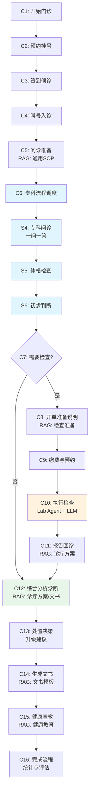

# 🏥 患者门诊管理多智能体系统

<div align="center">

**基于 LangGraph 的医院门诊诊疗流程多智能体模拟平台**

[](https://www.python.org/downloads/)
[](https://github.com/langchain-ai/langgraph)
[](LICENSE)

[功能特性](#-核心特性) • [快速开始](#-快速开始) • [项目结构](#-项目结构) • [运行指南](#-运行指南) • [核心模块](#-核心模块详解)

</div>

---

## 📋 项目简介

患者门诊管理多智能体系统是一个基于 **LangGraph** 编排的医院门诊诊疗流程模拟平台。系统采用多智能体协作模式（医生、护士、患者、检验科），当前支持 **神经医学科**，通过本地 **RAG 知识库**检索和可选的 **DeepSeek LLM** 增强，实现了高度可追踪、可复现的医疗流程仿真。

**v2.0 架构升级**：采用模块化设计，main 函数精简至 160 行纯流程编排（11步清晰流程），职责清晰分离，易于维护和扩展。配置管理直接整合到 Config 类，无需额外的加载器层。

### 🎯 核心特性

- 🤖 **多智能体协作**：医生、护士、患者、检验科四方智能体紧密协作
- 🏗️ **LangGraph 编排**：完整门诊流程（16个节点）+ 专科子图（3个节点），支持多科室扩展
- � **Adaptive RAG 系统** ✨ **NEW**：集成 SPLLM-RAG1，支持真实语义嵌入、多向量库检索（医学指南/临床案例/高质量问答/患者历史）
- 📚 **本地 RAG 系统**：基于 ChromaDB 的向量检索，关键节点强制检索知识库并记录引用溯源
- 🔒 **完全确定性**：Mock 外部系统基于 seed 保证可复现，便于测试和调试
- 📊 **完整审计追踪**：每步操作记录 audit_trail、citations，支持流程回放
- 👥 **多患者并发**：支持多医生多患者并发场景，自动负载均衡和队列管理
- 🌍 **物理环境模拟**：模拟真实医院空间、时间流逝、设备排队等约束
- 💾 **数据库支持**：支持 MySQL 持久化，完整的患者就诊记录管理
- ✨ **模块化架构**：职责清晰分离，main 函数仅负责流程编排，易于维护和扩展

### 🆕 Adaptive RAG 集成

本系统完全采用 **SPLLM-RAG1** 的 Adaptive RAG，显著提升检索精度：

| 特性 | 传统 RAG | **本系统 (Adaptive RAG)** ✨ |
|------|----------|---------------------|
| 嵌入方式 | 哈希嵌入 | 真实语义嵌入（text2vec-base-chinese） |
| 向量库数量 | 1个 | 4个（指南/案例/问答/历史） |
| 检索精度 | ⭐⭐⭐ | ⭐⭐⭐⭐⭐ |
| 患者历史记忆 | ❌ | ✅ |
| 高质量问答参考 | ❌ | ✅ |

**配置**（`src/config.yaml`）：
```yaml
rag:
  spllm_root: ../SPLLM-RAG1     # SPLLM-RAG1 路径
  adaptive_threshold: 0.3       # 余弦距离阈值
```

**快速测试**：
```bash
python test_adaptive_rag.py
```

📚 **详细文档**：
- [完整集成指南](./docs/adaptive_rag_integration.md) - 架构、配置、故障排查
- [快速启动教程](./docs/adaptive_rag_quickstart.md) - 5分钟快速启动指南

### 🏥 支持的科室

**当前已实现**：
- 神经医学科 (Neurology)

**架构特性**：通用专科子图设计，新增科室仅需配置知识库和科室参数即可

---

## 🚀 快速开始

### 环境要求

- Python 3.10+
- pip 包管理器

### 安装依赖

```bash
# 克隆或进入项目目录
cd patient_agent

# 安装依赖
pip install -r requirements.txt
```

### 初始化知识库

```bash
# 构建向量索引（ChromaDB）
python scripts/build_index.py
```

> 💡 **提示**：首次运行会自动加载 `kb/` 目录下的所有知识库文件并构建向量索引。

### 运行系统

#### 基本运行（单患者）

```bash
# 使用默认配置
python src/main.py

# 指定数据集ID
python src/main.py --dataset-id 15 --max-questions 5
```

#### 多患者并发模式

```bash
# 运行3个患者，间隔60秒进入
python src/main.py --num-patients 3 --patient-interval 60
```

#### 配置 DeepSeek API

```bash
# 设置环境变量（PowerShell）
$env:DEEPSEEK_API_KEY="sk-your-key-here"

# 或创建 .env 文件
# DEEPSEEK_API_KEY=sk-your-key-here

# 启用LLM增强
python src/main.py --enable-reports
```

### 配置管理

项目支持多层级配置，优先级从高到低：**CLI参数** > **环境变量** > **config.yaml** > **代码默认值**

**核心配置项**：
- **LLM配置**：backend（mock/deepseek）、enable_reports
- **智能体配置**：max_questions、max_triage_questions
- **RAG配置**：persist_dir、collection_name、skip_rag
- **运行模式**：multi_patient、num_patients、patient_interval
- **物理环境**：interactive
- **数据库**：enabled、connection_string、backup_to_file
- **系统**：verbose

> 📄 完整配置示例请参考 `src/config.yaml` 文件

---

## 📁 项目结构

```
patient_agent/
├── src/
│   ├── main.py                      # 🚀 主程序入口（极简流程编排）
│   ├── config.py                    # ⚙️ 配置管理（支持多层级配置加载）
│   ├── config.yaml                  # 📝 配置文件
│   │
│   ├── core/                        # 🏭 核心组件模块
│   │   └── initializer.py           # SystemInitializer（组件初始化）
│   ├── display/                     # 📺 显示与格式化模块
│   │   ├── log_formatter.py         # 日志格式化（颜色标识）
│   │   └── output_formatter.py      # 输出格式化（表格、统计）
│   │
│   ├── agents/                      # 🤖 智能体实现
│   │   ├── doctor_agent.py          # 医生智能体（问诊、开单、诊断）
│   │   ├── nurse_agent.py           # 护士智能体（分诊、宣教）
│   │   ├── patient_agent.py         # 患者智能体（模拟患者回答）
│   │   └── lab_agent.py             # 检验智能体（解读结果）
│   ├── coordination/
│   │   └── coordinator.py           # HospitalCoordinator（多患者调度）
│   ├── environment/
│   │   ├── hospital_world.py        # 物理环境模拟
│   │   ├── command_system.py        # 交互命令系统
│   │   └── staff_tracker.py         # 人员跟踪
│   ├── graphs/                      # 🕸️ LangGraph 流程编排
│   │   ├── common_opd_graph.py      # 通用门诊流程（C1-C16）
│   │   ├── router.py                # 图构建器
│   │   └── dept_subgraphs/
│   │       └── common_specialty_subgraph.py  # 通用专科子图（S4-S6）
│   ├── services/                    # 🔧 服务层
│   │   ├── workflow/                # 工作流控制
│   │   │   └── multi_patient.py     # MultiPatientWorkflow（多患者流程）
│   │   ├── appointment.py           # 预约服务
│   │   ├── billing.py               # 缴费服务
│   │   ├── lab.py                   # 实验室检查
│   │   ├── imaging.py               # 影像检查
│   │   ├── llm_client.py            # LLM 客户端
│   │   ├── medical_record.py        # 病例管理（文件存储）
│   │   ├── medical_record_db_service.py  # 病例管理（数据库存储）
│   │   ├── medical_record_dao.py    # 病例数据访问对象
│   │   ├── medical_record_integration.py  # 病例集成
│   │   └── db_models.py             # 数据库模型
│   ├── state/
│   │   └── schema.py                # BaseState 定义
│   ├── integration/                 # 集成适配层
│   ├── processing/                  # 多患者处理器
│   ├── logging_utils/               # 日志工具
│   ├── rag.py                       # RAG 检索器（ChromaDB）
│   ├── loaders.py                   # 数据加载器（诊断数据集）
│   ├── utils.py                     # 工具函数（JSON解析、日志等）
│   ├── config.py                    # 配置管理
│   └── prompts/                     # LLM 提示词模板
├── kb/                              # 知识库
│   ├── hospital/                    # 医院通用知识
│   │   ├── sop_*.md                 # 标准操作流程
│   │   ├── education_common.md      # 通用健康教育
│   │   └── sop_*.md
│   ├── forms/                       # 文书模板
│   │   ├── template_emr.md
│   │   ├── template_diagnosis_cert.md
│   │   └── template_sick_leave.md
│   └── neuro/                       # 神经医学科知识
│       ├── education_neuro.md
│       ├── guide_redflags.md        # 红旗症状指南
│       ├── plan_neuro.md            # 诊疗方案
│       └── prep_*.md                # 检查前准备
├── medical_records/                 # 患者病例数据
├── logs/
│   └── patients/                    # 每个患者详细日志
├── scripts/
│   ├── build_index.py               # 构建向量索引
│   └── seed_kb_examples.py          # 初始化示例数据
├── tests/                           # 测试用例
├── requirements.txt                 # 依赖清单
├── config.yaml                      # 全局配置文件
└── README.md
```

---

## 🏗️ 流程设计

### 门诊流程图（C1-C16）

#### 文本流程图

```
患者挂号登记 (C1-C4)
    ↓
初诊问诊准备 (C5) [RAG: 通用SOP]
    ↓
专科问诊 (C6 → S4-S6) [RAG: 专科知识库]
    ↓
判断是否需要辅助检查 (C7)
    ├─→ 是 → 开单准备说明 (C8) [RAG: 检查准备]
    │         ↓
    │     缴费和预约 (C9) [Mock: 预约系统]
    │         ↓
    │     执行检查并增强报告 (C10) [Lab Agent生成 + LLM增强]
    │         ↓
    │     报告回诊 (C11) [RAG: 诊疗方案]
    │         ↓
    └─────→ 综合分析诊断 (C12) [RAG: 诊疗方案/文书]
            ↓
        处置决策 (C13) [升级建议]
            ↓
        生成诊疗文书 (C14) [RAG: 文书模板]
            ↓
        健康宣教与随访 (C15) [RAG: 健康教育]
            ↓
        完成流程 (C16) [统计与评估]
```

#### Mermaid 流程图



### 专科子图（S4-S6）

**S4: Specialty Interview** - 一问一答模式
- 医生根据问诊要点逐步提问
- 患者基于病例数据回答
- RAG 检索科室知识库指导提问

**S5: Physical Exam** - 体格检查
- 模拟真实检查流程
- 基于主诉和病历生成检查发现

**S6: Preliminary Judgment** - 初步判断
- 综合分析决定是否需要辅助检查
- RAG 检索诊疗指南确定检查建议

### 完整节点说明

#### 通用门诊流程（C1-C16）

| 节点 | 名称 | 职责 | 关键技术 |
|------|------|------|---------|
| C1 | 开始门诊流程 | 验证状态、记录开始时间 | 状态初始化 |
| C2 | 预约挂号 | 挂号、生成就诊号 | AppointmentService |
| C3 | 签到候诊 | 患者签到、进入候诊队列 | 队列管理 |
| C4 | 叫号入诊 | 医生叫号、分配诊室 | 医生资源调度 |
| C5 | 问诊准备 | 检索通用SOP、初始化问诊记录 | RAG检索 |
| C6 | 专科流程调度 | 调用专科子图（S4-S6） | 子图调度 |
| C7 | 路径决策 | 判断是否需要辅助检查 | 条件分支 |
| C8 | 开单与准备说明 | 开具检查单、检索准备知识 | RAG检索 |
| C9 | 缴费与预约 | 生成订单、预约检查时间 | BillingService |
| C10 | 执行检查 | 执行检查、生成结果、LLM增强报告 | Lab Agent + LLM |
| C11 | 报告回诊 | 医生解读报告、复诊评估 | RAG检索诊疗方案 |
| C12 | 综合分析诊断 | 明确诊断、制定治疗方案 | RAG检索 + 三智能体 |
| C13 | 处置决策 | 升级建议（急诊/住院/会诊/转诊） | 规则引擎 |
| C14 | 生成文书 | 生成病历、诊断证明、病假条 | RAG检索模板 |
| C15 | 健康宣教与随访 | 健康教育、随访安排 | RAG检索宣教内容 |
| C16 | 完成流程 | 记录结束时间、统计、评估 | 流程统计 |

#### 专科子图（S4-S6）

| 节点 | 名称 | 职责 | 关键技术 |
|------|------|------|---------|
| S4 | 专科问诊 | 一问一答模式问诊、收集病史 | Doctor Agent + Patient Agent + RAG |
| S5 | 体格检查 | 模拟体格检查、记录体征 | 基于病例数据模拟 |
| S6 | 初步判断 | 分析是否需要辅助检查、开具检查单 | Doctor Agent + RAG |

---

## 🧪 核心模块详解

### 架构设计

系统采用**模块化分层架构**，职责清晰分离：

- **入口层** (`main.py`)：极简流程编排（160行），11步清晰流程
- **配置层** (`config.py`)：多层级配置管理（CLI > 环境变量 > YAML > 默认值）
- **核心层** (`core/`)：组件初始化器，统一管理所有核心组件
- **显示层** (`display/`)：日志格式化和输出展示（共164行）
- **业务层** (`services/workflow/`)：工作流控制和业务逻辑（共282行）
- **智能体层** (`agents/`)：医生、护士、患者、检验科智能体
- **编排层** (`graphs/`)：LangGraph 流程图定义

### 1. 系统初始化器 (`core/initializer.py`)

统一管理所有核心组件的初始化，包括日志系统、大语言模型、知识库检索器、业务服务（预约、计费）、病例库服务和医院协调器的初始化。

### 2. 多患者工作流 (`services/workflow/multi_patient.py`)

负责多患者并发诊断流程控制，包括医生注册、患者处理器初始化、病例选择、患者调度、状态监控、完成等待和系统关闭等功能。

### 3. 医生智能体 (`agents/doctor_agent.py`)

负责问诊、检查建议、诊断制定。支持状态重置、一问一答模式问诊、完整问诊流程、检查项目建议、综合分析诊断等核心医疗决策功能。

### 4. 护士智能体 (`agents/nurse_agent.py`)

负责科室分诊、生命体征测量、健康宣教、检查前准备说明等护理工作。

### 5. 患者智能体 (`agents/patient_agent.py`)

模拟真实患者症状和回答，基于病例数据向护士描述症状、回答医生问题，实现逼真的患者交互。

### 6. 医院协调器 (`coordination/coordinator.py`)

多患者并发管理和医生资源调度中心，负责医生注册、患者挂号、医生分配、空闲医生查询等协调工作。

### 7. 物理环境模拟 (`environment/hospital_world.py`)

模拟医院物理空间、时间流逝、设备资源等真实约束，支持 agent 添加、移动、设备使用、检查执行等物理世界交互。

### 8. RAG 检索系统 (`rag.py`)

基于 ChromaDB 向量数据库和 HashEmbeddingFunction 嵌入模型的本地知识检索系统，支持按科室和类型过滤，自动包含文档信息、相关度评分等元数据。

**知识库结构**：按科室和类型组织，包括医院通用知识（SOP、通用教育）、文书模板（病历、诊断证明）和专科知识（神经科教育、红旗症状指南、诊疗方案、检查准备）。

### 9. 状态管理 (`state/schema.py`)

BaseState 包含完整的就诊状态信息：运行ID、科室、患者ID、主诉、现病史、检查单、检查报告、诊断、治疗方案、升级建议、审计追踪、RAG检索结果等核心数据。审计追踪记录每个节点的时间戳、输入输出摘要、决策依据、引用文献和标志位（LLM使用、RAG检索等）。

---

## 🏛️ 架构优势

### v2.0 模块化重构

#### 重构后（v2.0）
- ✅ main.py 仅 160 行（11步清晰流程）
- ✅ 职责分离：配置、初始化、业务、显示各司其职
- ✅ 易于维护：修改某功能只需修改对应模块
- ✅ 易于测试：每个模块可独立测试
- ✅ 易于扩展：新增功能不影响主流程
- ✅ 配置直接整合：Config.load() 统一管理配置加载

#### 核心模块

| 模块 | 职责 | 行数 |
|------|------|------|
| `config.py` | 配置管理 | ~287 |
| `core/` | 组件初始化 | ~134 |
| `display/` | 格式化输出 | ~164 |
| `services/workflow/` | 工作流控制 | ~282 |
| `main.py` | 流程编排 | ~160 |

**设计原则**：
- 单一职责原则（SRP）
- 开闭原则（OCP）
- 依赖注入（DI）
- 关注点分离（SoC）

---

## 🔧 高级功能

### 自定义配置

使用 `--config` 参数指定自定义配置文件，或通过环境变量覆盖特定配置项。

### 审计追踪分析

系统自动记录完整的追踪日志（`agent_trace.json`），包含：
- **RAG引用溯源**：每个节点的知识库检索记录和引用文献
- **LLM调用统计**：LLM使用标记和调用次数
- **决策路径**：每步的输入输出摘要和决策依据
- **时间戳**：精确到毫秒的流程时间线

---

## 📊 外部系统 Mock

所有 Mock 服务基于 `seed` 保证确定性输出：

| 服务 | 模块 | 功能 | 确定性 |
|------|------|------|--------|
| 预约服务 | `appointment.py` | 挂号、签到、叫号 | ✅ Seed-based |
| 缴费服务 | `billing.py` | 费用计算、记录 | ✅ Seed-based |
| 实验室 | `lab.py` | 血常规、肝功能等 | ✅ Mock数据 |
| 影像检查 | `imaging.py` | CT、MRI、超声 | ✅ Mock数据 |

---

## 🛡️ 安全机制

### 红旗症状识别

系统在 C12（综合分析诊断）节点通过 `apply_safety_rules()` 自动检测危重症状并触发升级：

**自动触发急诊**：
- 🚨 神经系统红旗：意识障碍、昏迷、偏瘫、肢体无力、言语不清

**自动触发会诊**：
- 👥 影像检查异常需进一步评估
- 👥 实验室检查异常需结合临床处理

> 💡 升级建议记录在 `state.escalations` 字段，并在随访计划中提示应急处理

---

## 💾 数据持久化

### 文件存储模式

病例数据以 JSON 格式存储在 `medical_records/` 目录，每个患者一个独立文件。

### 数据库存储模式

支持 MySQL 持久化，包含三个核心表：
- **Patient 表**：患者基本信息
- **MedicalCase 表**：就诊病例（支持多次就诊）
- **Examination 表**：检查检验结果

在 `config.yaml` 中配置 `database.enabled: true` 并设置连接字符串即可启用。

---

## 📖 环境变量

| 变量名 | 说明 | 默认值 |
|--------|------|--------|
| `DEEPSEEK_API_KEY` | DeepSeek API 密钥 | - |
| `DEEPSEEK_MODEL` | 模型名称 | `deepseek-chat` |
| `DEEPSEEK_BASE_URL` | API 端点 | `https://api.deepseek.com` |
| `AGENT_MAX_QUESTIONS` | 医生最多问题数 | `3` |
| `ENABLE_RAG` | 启用RAG系统 | `true` |

---

## 📝 日志系统

系统为每个患者在 `logs/patients/` 目录生成独立日志文件（格式：`patient_XXX_日期_时间.log`）。

**日志内容**：完整诊疗流程、问诊对话、RAG检索结果、检查报告、诊断结果、审计追踪和决策依据。

---

## 🔗 依赖组件

| 组件 | 版本 | 用途 |
|------|------|------|
| LangGraph | 1.0.7 | 流程编排 |
| ChromaDB | 1.4.1 | 向量数据库 |
| Pydantic | 2.12.5 | 数据验证 |
| SQLAlchemy | 2.0.36 | ORM |
| PyMySQL | 1.1.1 | MySQL 驱动 |
| Typer | 0.21.1 | CLI 框架 |
| Rich | 14.3.0 | 彩色输出 |
| NumPy | 2.4.1 | 数值计算 |
| Pandas | 2.2.0 | 数据处理 |

---

## ✅ 系统能力矩阵

| 能力维度 | 实现状态 | 说明 |
|---------|---------|------|
| **多智能体协作** | ✅ 完整 | 医生、护士、患者、检验科协作 |
| **多患者并发** | ✅ 完整 | 自动负载均衡和队列管理 |
| **物理环境模拟** | ✅ 完整 | 时间、空间、设备约束 |
| **RAG知识检索** | ✅ 完整 | 关键节点强制检索 |
| **审计追踪** | ✅ 完整 | 完整的决策记录和溯源 |
| **数据库持久化** | ✅ 完整 | MySQL支持 |
| **LLM增强** | ⚡ 可选 | DeepSeek集成 |
| **红旗症状识别** | ✅ 完整 | 自动升级触发 |
| **多科室支持** | ✅ 可扩展 | 当前神经科，框架支持扩展 |
| **模块化架构** | ✅ v2.0 | 职责清晰，易维护扩展 |
| **流程编排** | ✅ 极简 | main函数160行(11步清晰流程) |

---

## 📄 许可证

本项目采用 MIT 许可证。详见 [LICENSE](LICENSE) 文件。

---

## ⚠️ 免责声明

本项目仅用于技术演示和教学目的，不构成任何医疗建议。如有健康问题，请咨询专业医疗机构。

---

<div align="center">

**Made with ❤️ by Patient Agent Team**

</div>
