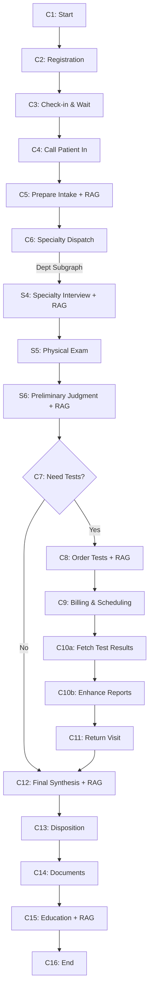

# 🏥 Hospital Agent System

<div align="center">

**基于 LangGraph 的智能医院门诊多智能体系统**

[](https://www.python.org/downloads/)
[](https://github.com/langchain-ai/langgraph)
[](LICENSE)
[](CONTRIBUTING.md)

[功能特性](#-功能特性) • [快速开始](#-快速开始) • [架构设计](#-架构设计) • [使用文档](#-使用指南) • [贡献指南](#-贡献)

</div>

---

## 📋 项目简介

Hospital Agent System 是一个基于 **LangGraph** 编排的智能医院门诊模拟系统，支持 **15 个标准科室**的完整诊疗流程。项目通过多智能体协作（医生、护士、患者）、本地 RAG 知识库检索和可选的 DeepSeek LLM 增强，实现了高度可追溯、可复现的医疗流程仿真。

### 🎯 核心特性

- 🤖 **多智能体协作**：医生、护士、患者三方智能体协同工作
- 🏗️ **LangGraph 编排**：通用流程 + 可插拔专科子图，支持 15 个标准科室
- 📚 **本地 RAG 系统**：基于 ChromaDB 的知识库检索，关键节点强制引用并记录溯源
- 🔒 **完全确定性**：Mock 外部系统（预约/缴费/检查），基于 seed 保证可复现
- 📊 **完整审计追踪**：每步操作记录 `audit_trail` 和 `citations`
- ⚡ **安全分流机制**：红旗症状自动触发升级（急诊/住院/会诊/转诊）

### 🏥 支持的科室

内科、外科、骨科、泌尿外科、妇产科、儿科、神经医学、肿瘤科、感染性疾病科、皮肤性病科、眼耳鼻喉口腔科、精神心理科、急诊医学科、康复疼痛科、中医科

> **⚠️ 免责声明**：本项目仅用于技术演示和教学目的，不构成任何医疗建议。如有健康问题，请咨询专业医疗机构。

---

## 🚀 快速开始

### 环境要求

- Python 3.10+
- pip 包管理器

### 安装步骤

1. **克隆仓库**

```bash
git clone https://github.com/yourusername/hospital-agent-system.git
cd hospital-agent
```

2. **安装依赖**

```bash
pip install -r requirements.txt
```

3. **初始化知识库**

```bash
python scripts/seed_kb_examples.py
```

4. **构建向量索引**

```bash
python scripts/build_index.py
```

生成的索引存储在 `.chroma/` 目录中。


#### DeepSeek 配置

```bash
# 设置 API Key (PowerShell)
$env:DEEPSEEK_API_KEY="sk-your-key-here"

# 或使用 .env 文件
# 创建 .env 文件并添加: DEEPSEEK_API_KEY=sk-your-key-here

# 运行
python src/main.py 
```

### 配置文件

项目支持通过 `config.yaml` 进行配置，优先级：`CLI 参数 > 环境变量 > config.yaml > 默认值`

```yaml
llm:
  backend: deepseek        # mock 或 deepseek
  enable_reports: false    # LLM 增强报告

agent:
  max_questions: 15        # 医生最多问题数
  dataset_id: 61           # 数据集索引
  use_hf_data: true        # 使用 HuggingFace 数据

rag:
  persist_dir: .chroma
  collection_name: hospital_kb

system:
  seed: 42                 # 随机种子
```

---

## 📁 项目结构

```
hospital_agent/
├── src/
│   ├── agents/              # 智能体实现
│   │   ├── doctor_agent.py  # 医生智能体
│   │   ├── nurse_agent.py   # 护士智能体
│   │   └── patient_agent.py # 患者智能体
│   ├── graphs/              # LangGraph 流程图
│   │   ├── common_opd_graph.py          # 通用门诊流程 (C1-C16)
│   │   ├── router.py                    # 流程装配器
│   │   └── dept_subgraphs/              # 专科子图
│   │       └── common_specialty_subgraph.py  # 通用专科子图 (S4-S6)
│   ├── services/            # 外部系统 Mock
│   │   ├── appointment.py   # 预约服务
│   │   ├── billing.py       # 缴费服务
│   │   ├── lab.py           # 实验室检查
│   │   ├── imaging.py       # 影像检查
│   │   ├── endoscopy.py     # 内镜检查
│   │   ├── neurophysiology.py  # 神经生理检查
│   │   ├── document.py      # 文书生成
│   │   └── llm_client.py    # LLM 客户端
│   ├── state/               # 状态管理
│   │   └── schema.py        # BaseState 定义
│   ├── prompts/             # LLM 提示词
│   ├── rag.py               # RAG 检索器
│   ├── loaders.py           # 数据加载器
│   ├── utils.py             # 工具函数
│   ├── config.py            # 配置管理
│   └── main.py              # CLI 入口
├── kb/                      # 知识库
│   ├── hospital/            # 医院通用知识
│   ├── forms/               # 文书模板
│   └── {dept}/              # 各科室专业知识
├── scripts/
│   ├── seed_kb_examples.py  # 初始化知识库
│   └── build_index.py       # 构建向量索引
├── config.yaml              # 配置文件
├── requirements.txt         # 依赖清单
└── README.md
```

---

## 🏗️ 架构设计


### 诊疗流程 (C1-C16)

> **说明**：C0（护士预检分诊）已在 `main.py` 初始化时完成，图中从C1开始。



### 关键节点说明

| 节点 | 描述 | RAG 强制检索 | LLM 增强 |
|------|------|-------------|---------|
| **C5** | 问诊准备 | ✅ hospital SOP | ❌ |
| **S4** | 专科问诊（子图） | ✅ 专科知识库 | 可选 |
| **S6** | 初步判断（子图） | ✅ 检查指南 | ❌ |
| **C8** | 开单与准备说明 | ✅ 通用SOP + 专科准备 | ❌ |
| **C10a** | 获取检查结果 | ❌ | 可选（数据集/LLM） |
| **C10b** | 增强报告叙述 | ❌ | 可选（报告解读） |
| **C12** | 综合分析诊断 | ✅ 诊疗方案/文书模板 | 可选 |
| **C15** | 宣教与随访 | ✅ 通用+专科健康教育 | 可选 |

---

## 🧪 数据集支持

### HuggingFace 数据集集成

项目支持从 [SII-SPIRAL-MED/DiagnosisArena](https://huggingface.co/datasets/SII-SPIRAL-MED/DiagnosisArena) 加载真实医疗诊断案例。


### 环境变量配置

| 变量名 | 说明 | 默认值 | 可选值 |
|--------|------|--------|-------|
| `DEEPSEEK_API_KEY` | DeepSeek API 密钥 | - | `sk-xxx` |
| `DEEPSEEK_MODEL` | 模型名称 | `deepseek-chat` | `deepseek-chat` |
| `DEEPSEEK_BASE_URL` | API 端点 | `https://api.deepseek.com` | - |
| `ENABLE_DATASET_TRANSLATION` | 启用数据集翻译 | `true` | `true`/`false`/`1`/`0` |

---

## 📚 核心模块详解

### 智能体系统（Multi-Agent）

#### 1. 医生智能体 (`doctor_agent.py`)
- 动态设置专科身份（支持 15 个科室）
- 专科问诊与病史采集
- 初步判断与检查建议
- 综合分析与诊疗方案制定

#### 2. 护士智能体 (`nurse_agent.py`)
- 预检分诊
- 检查/检验前准备说明
- 检查执行协助
- 健康宣教

#### 3. 患者智能体 (`patient_agent.py`)
- 模拟真实患者症状
- 基于病例数据回答问题
- 支持 HuggingFace 数据集加载

### LangGraph 编排

#### 通用门诊流程 (`common_opd_graph.py`)
实现了完整的 C1-C16 节点流程：

> **注意**：C0（护士预检分诊 + Agent初始化）已移至 `main.py` 的初始化阶段执行，流程从C1开始。

**前置流程**
- C1: Start - 验证状态、记录开始时间、显示患者概览
- C2: Registration - 挂号预约
- C3: Check-in & Wait - 签到候诊
- C4: Call In - 叫号入诊室

**核心诊疗**
- C5: Prepare Intake - 问诊准备（检索医院通用SOP，初始化问诊记录）
- C6: Specialty Dispatch - 专科子图分发（实际问诊在此执行）
- C7: Decide Path - 路径决策（是否需要辅助检查）

**辅助检查分支**
- C8: Order & Explain Tests - 开单并检索准备知识 + RAG（通用SOP + 专科准备说明）
- C9: Billing & Scheduling - 缴费与预约调度（生成检查准备清单）
- C10a: Fetch Test Results - 获取检查结果数据（从数据集或LLM生成）
- C10b: Enhance Reports - 增强检查报告（生成叙述和解读）
- C11: Return Visit - 报告回诊（智能补充问诊）

**诊断与处理**
- C12: Final Synthesis - 综合分析与诊断 + RAG（诊疗方案/文书模板）
- C13: Disposition - 处置决策（根据升级建议）
- C14: Documents - 使用LLM生成门诊医疗文书
- C15: Education & Follow-up - 宣教与随访 + RAG（健康教育）
- C16: End - 结束流程（记录统计、评估准确性）

#### 专科子图 (`common_specialty_subgraph.py`)
支持 15 个科室的通用专科子图（S4-S6）：
- S4: Specialty Interview - 专科问诊 + 动态 RAG
- S5: Physical Exam - 体格检查
- S6: Preliminary Judgment - 初判 + RAG（检查指南）

### 状态管理 (`state/schema.py`)

**BaseState** 包含完整的就诊状态：

```python
class BaseState(BaseModel):
    run_id: str                    # 运行ID
    dept: str                      # 科室
    chief_complaint: str           # 主诉
    history_present_illness: dict  # 现病史
    ordered_tests: List[dict]      # 检查/检验单
    test_results: List[dict]       # 检查报告
    diagnosis: dict                # 诊断
    treatment_plan: dict           # 治疗方案
    escalations: List[str]         # 升级建议
    audit_trail: List[dict]        # 审计追踪
    retrieved_chunks: List[dict]   # RAG 检索结果
    # ... 更多字段
```

**审计追踪格式**：
```json
{
  "ts": "2026-01-02T10:30:00Z",
  "node_name": "C5_common_intake",
  "inputs_summary": {...},
  "outputs_summary": {...},
  "decision": "proceed_to_specialty",
  "citations": [
    {"doc_id": "hospital_sop_001", "chunk_id": "ch_003", "score": 0.89}
  ],
  "flags": ["LLM_USED", "RAG_RETRIEVED"]
}
```

### RAG 系统

#### 知识库结构 (`kb/`)
```
kb/
├── hospital/          # 医院通用知识
│   ├── sop_intake.md
│   ├── sop_billing_reports.md
│   └── education_common.md
├── forms/             # 文书模板
│   ├── template_emr.md
│   ├── template_diagnosis_cert.md
│   └── template_sick_leave.md
└── {dept}/            # 各科室专业知识
    ├── education_{dept}.md
    ├── guide_redflags.md
    ├── plan_{dept}.md
    └── prep_{exam}.md
```

#### 检索器 (`rag.py`)
- **嵌入函数**：HashEmbeddingFunction（完全本地、确定性）
- **向量数据库**：ChromaDB（持久化到 `.chroma/`）
- **检索策略**：支持按 `dept` 和 `type` 过滤
- **元数据**：自动包含 `doc_id`、`chunk_id`、`source`、`updated_at`

### 外部系统 Mock

所有 Mock 服务基于 `seed` 保证确定性输出：

| 服务 | 模块 | 功能 |
|------|------|------|
| 预约服务 | `appointment.py` | 挂号、签到、叫号 |
| 缴费服务 | `billing.py` | 费用计算、缴费记录 |
| 实验室 | `lab.py` | 血常规、肝功能、Hp C13 等 |
| 影像检查 | `imaging.py` | CT、MRI、超声 |
| 内镜检查 | `endoscopy.py` | 胃镜、肠镜、肠道准备 |
| 神经生理 | `neurophysiology.py` | EEG、EMG、NCV |
| 文书生成 | `document.py` | 门诊病历、诊断证明、病假条 |

### 安全机制

#### 红旗症状识别 (`utils.py`)
自动触发升级建议：
- 🚨 **急诊**：生命体征异常、急性胸痛等
- 🏥 **住院**：严重并发症、需要住院治疗
- 👥 **会诊**：疑难病例、多学科协作
- ➡️ **转诊**：超出本科室诊疗范围

#### 否定词识别
避免误判：`"无黑便"` ≠ `"黑便"`

---

## 🔧 高级用法

### 自定义配置

创建自定义配置文件：

```yaml
# my_config.yaml
llm:
  backend: deepseek
  enable_reports: true

agent:
  max_questions: 20
  dataset_id: 100

system:
  seed: 12345
  save_trace: custom_trace.json
  enable_trace: true
```

运行：
```bash
python src/main.py --config my_config.yaml
```

### 审计追踪分析

保存的审计追踪可用于：
- 流程回放与分析
- RAG 引用验证
- LLM 调用监控
- 性能优化

```python
import json

# 加载追踪
with open("trace.json") as f:
    trace = json.load(f)

# 分析 RAG 引用
for entry in trace["audit_trail"]:
    if entry.get("citations"):
        print(f"{entry['node_name']}: {len(entry['citations'])} citations")

# 检查 LLM 调用
llm_calls = [e for e in trace["audit_trail"] if "LLM_USED" in e.get("flags", [])]
print(f"Total LLM calls: {len(llm_calls)}")
```

### 批量处理

处理多个病例：

```bash
# Bash
for i in {1..10}; do
  python src/main.py --dataset-id $i --save-trace "trace_$i.json"
done

# PowerShell
1..10 | ForEach-Object {
  python src/main.py --dataset-id $_ --save-trace "trace_$_.json"
}
```

---

## 🧪 测试

### 运行测试

```bash
# 运行所有测试
pytest

# 详细输出
pytest -v

# 测试覆盖率
pytest --cov=src --cov-report=html
```

### 测试覆盖范围

- ✅ 通用门诊流程（C1-C16）
- ✅ 专科子图（15 个科室）
- ✅ RAG 检索与引用追踪
- ✅ Mock 服务确定性
- ✅ LLM 失败降级
- ✅ 红旗症状触发

---

## 📖 使用指南


## 📄 许可证

本项目采用 MIT 许可证。详见 [LICENSE](LICENSE) 文件。

---

## 🙏 致谢

- [LangGraph](https://github.com/langchain-ai/langgraph) - 强大的图编排框架
- [ChromaDB](https://www.trychroma.com/) - 向量数据库
- [DeepSeek](https://www.deepseek.com/) - LLM 支持
- [HuggingFace](https://huggingface.co/) - 数据集平台
- [SII-SPIRAL-MED/DiagnosisArena](https://huggingface.co/datasets/SII-SPIRAL-MED/DiagnosisArena) - 医疗诊断数据集

---

## 📬 联系方式

- 项目主页：[GitHub](https://github.com/yourusername/hospital-agent-system)
- 问题反馈：[Issues](https://github.com/yourusername/hospital-agent-system/issues)
- 功能请求：[Discussions](https://github.com/yourusername/hospital-agent-system/discussions)

---

<div align="center">

**⭐ 如果这个项目对你有帮助，请给它一个 Star！⭐**

Made with ❤️ by [Your Name]

</div>
